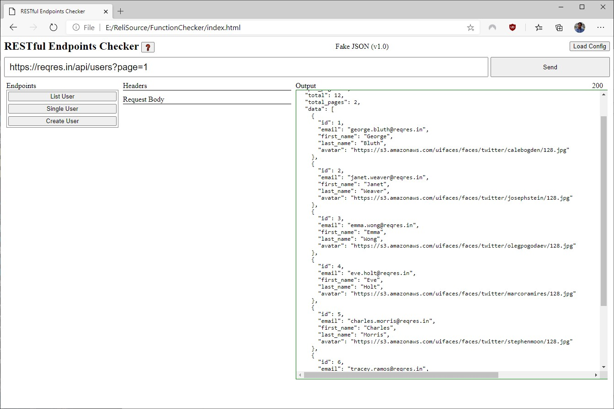

# RESTful Endpoint Checker
Built with [Alpine.js](https://github.com/alpinejs/alpine)



**About the Config File**

Example

```json
{
  "name": "Fake JSON",
  "version": "1.0",
  "endpoints": [
    {
      "name": "List User",
      "url": "https://reqres.in/api/users?page=1",
      "method": "GET",
      "headers": [],
      "requestBody": []
    },
    {
      "name": "Single User",
      "url": "https://reqres.in/api/users/2",
      "method": "GET",
      "headers": [],
      "requestBody": []
    },
    {
      "name": "Create User",
      "url": "https://reqres.in/api/users",
      "method": "POST",
      "headers": [],
      "requestBody": [
        {
          "name": "name",
          "type": "text"
        },
        {
          "name": "job",
          "type": "text"
        }
      ]
    }
  ]
}

```

***Syntax/Tags:***

* `Name` is the name of the configuration file.
* `version` is the version for the config file.
* `endpoints` is all the endpoints for this config
  * `name` endpoint name
  * `url` endpoint URL
  * `method` endpoint methods. Ex: `GET, POST` etc.
  * `headers` headers keys. Ex: `"headers": ["Content-Type", "Token"]`
  * `requestBody` is the request body.
    * `name` is the key for request object.
    * `type` will be the type it will render in input box Ex: `text, checkbox, number, email` etc.